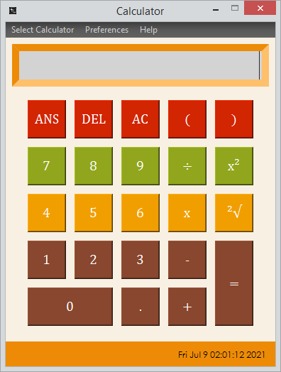
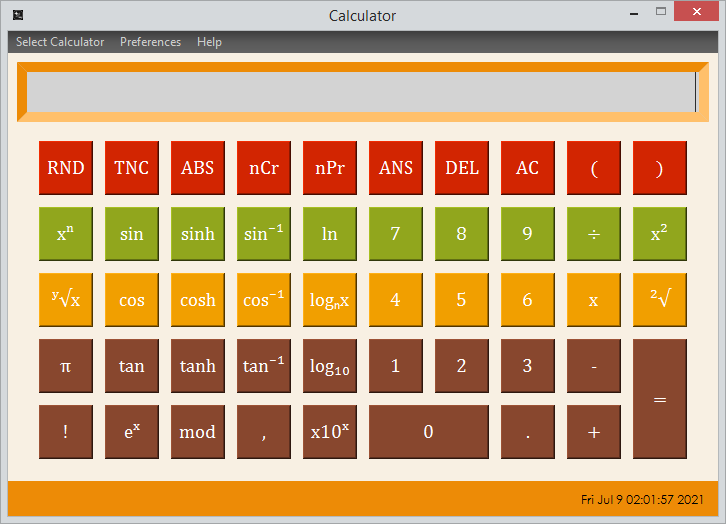
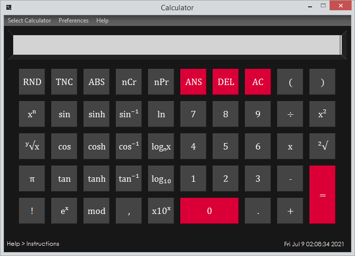

[](https://www.python.org/) 


# `Burgir Calculator`
## Introduction

This calculator was made with love and effort. The name and layout of our calculator is inspired by the man, the myth, and the legend himself, Abdu Rozik.
<p align="center">
  
</p>

- **Written with Python 3.9 (Can work with 3.7.9)**
- **Uses PyQt6 as the GUI Framework**
- **Uses Pyparsing for the calculator logic**

## Features

> **Calculator Logic:**

- Numeric keypad (0-9) with decimal point
- Can perform `addition` (+) , `subtraction` (-), `multiplication` (*), and `division` (/)
- Can perform trigonometric operations (`sine`, `cosine`, `tangent`, `inverses`, `hyperbolic`)
- Can perform `logarithmic` and `exponential` operations
- Can perform other algebraic operations (`square root`, `cube root`, `scientific notations`, etc.)
- Capable of chaining multiple operations together (with or without parentheses) and execute them in the correct order
- Can perform `round`, `truncate`, `modular`, and `absolute functions`
- Other necessary functions: `delete`, `clear all`, `ANS`, etc.

> **UI:**
- **NEW!** Dark Theme
- Can switch between the basic calculator layout to the scientific calculator layout.
- A button press effect, which can be changed or disabled.
- A subtle background music.
- A date and time widget in the status bar.
- A status bar that shows tips on how to use certain functions.
- An Instructions window that shows general instructions on how to use our calculator.
- An About window that has a link for our GitHub repository and presentation video (to be updated as we finish it)

_And some extra little adjustment to the UI, the windows are non-resizable so that the layout is preserved. By extension, the calculator can't be maximized._

> **Layout:**

**Basic Calculator**

<p align="center">
  
</p>

**Scientific Calculator**

<p align="center">
  
</p>

**Dark Theme**

<p align="center">
  
</p>

## How to Set Up

1. Clone or download the repository.
2. Install the necessary dependencies:
```
pip install -r requirements.txt
```
3. Run the program:
```
python main.py
```
4. Make sure all the `.py` files are located in the same folder. 
5. Make sure the `resources` folder is also within the same directory, as the UI uses files that are in this folder.

* Calculator logic is located in `calculator.py`
* UI code is located in `ui.py`
* You can initiate some tests for the calculator logic with `test.py`

## How To Use

- Switch between the layouts by clicking the button in the menu, or by pressing `Ctrl+1` on your keyboard.
- Switching between the dark theme and burgir theme can also be done with `Ctrl+2`.
- General instructions are inside the *Instructions* page which can be accessed in the menu or by pressing `Ctrl+3`.
- If you want to change or disable click sound, you can do so by accessing the menu in `Preferences`
- Use the buttons to put numbers and functions to the display.
- Make sure to properly use the parentheses and comma so the functions will work.
- Parentheses must have an operation between them. `3*(3)` is not the same as `3(3)`. The latter won't work.

## Team

| Name                       |Role                                                   |
| -------------------------- | ----------------------------------------------------- |
| **[Ralph Palmaira](https://github.com/JARalph23Z)**| Team Leader / UI Coder         |
| **[Ray Dalipe](https://github.com/Torurae)**      | UI Designer / Documentation |
| **[Brixson Domantay](https://github.com/brxzn)**  | Logic Coder |
| **[Hans Tulayan](https://github.com/Meriodasu007)**        | Test File Coder                 |
| **[Saile Galilea](https://github.com/Kkaepsong)** | UI Designer / Documentation            |

# Disclaimer
```
All the codes within this repository are either self-made or adapted from other repositories under the MIT 
License, which allows for the distribution and alteration of such codes. If you wish, you can open an issue 
so we can address any problems immediately. 

Thank you for your understanding.
```
